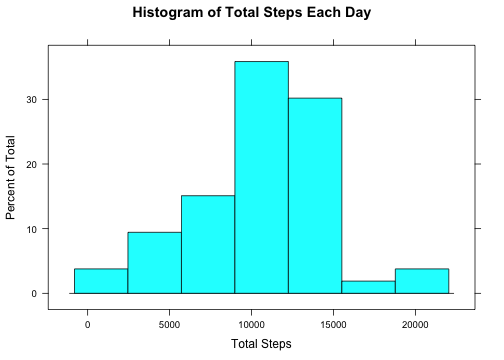
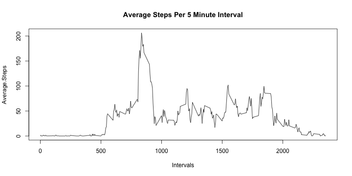
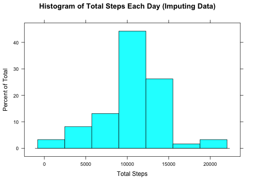
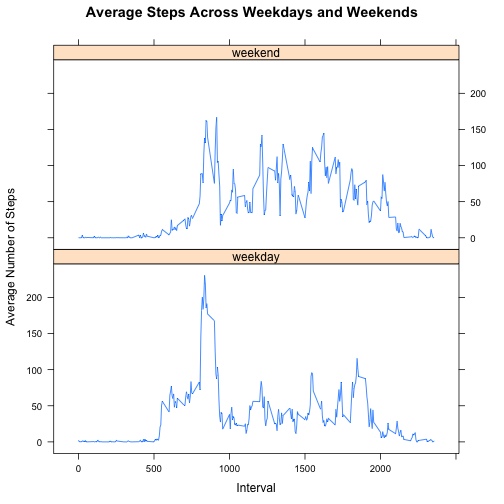

Activity Monitoring Data (Peer Assessment #1)
===========================================
## Introduction

This dataset consists of the number of steps taken in 5 minute intervals over a period of two months.  

The variables included in this dataset are:

* steps: Number of steps taking in a 5-minute interval (missing values are coded as NA)
* date: The date on which the measurement was taken in YYYY-MM-DD format
* interval: Identifier for the 5-minute interval in which measurement was taken

The dataset is stored in a comma-separated-value (CSV) file and there are a total of 17,568 observations in this dataset.


##Loading and Preprocessing the Data
### Initiating section

Load packages if required


```r
slibs<-c("data.table","lattice","plyr","dplyr", "timeDate", "xtable")
for (lib in slibs) {
  if (lib %in% rownames(installed.packages())==FALSE){
      install.packages(lib, dependencies = T, repos="http://cran.rstudio.com/")
      }
  require(lib, character.only=TRUE)
}
```

##
Identify the source file required for this analysis


```r
ActivityFile<-"activity.csv" 
```


Initiate Error message for source file not found


```r
FileNotFoundMsg<-"Data file not found in working directory"
```

###Reading the source file

List all files in current working directory and Verify the data file exist in the working directory.  If file exists then read data files else write error message.


```r
dirfiles<-dir(".") 
if (ActivityFile %in% dirfiles) {
      Activity<- read.csv(ActivityFile)      
}else {stop(FileNotFoundMsg)}
```

##What is the Mean Total Number of Steps Taken Per Day?
###Calculate total steps, mean and median per day

This section  calulates the total number of steps, mean and median per day into a summary table ignoring the missing values in the dataset.


```r
StepSummary<-
      na.omit(Activity)%>%
      group_by(date)%>%
      summarize(Total.Steps = sum(steps),
                Daily.Mean = mean(steps),
                Daily.Median = median(steps))
```

###Table 1 - Total steps, mean and median per day


```r
StepSummary$date<-as.character(StepSummary$date)
StepSummaryView<-StepSummary
colalignment <-c("l","c","c","c","c")
coldisplay <-c("d","s","d","f","f")
colnames(StepSummaryView)<- c("Date", "Total Number of Steps", "Mean", "Median")

print(xtable(StepSummaryView, digit=2, 
                     caption="Summary of Steps by Day", 
                     align=colalignment, display=coldisplay), 
      type= "html", 
      caption.placement ="top",
      include.rownames = FALSE,
      html.table.attributes = 'border=1 width="60%" align="center"',
      format.args=list(big.mar=","))
```

<!-- html table generated in R 3.1.3 by xtable 1.7-4 package -->
<!-- Sat Apr 11 23:17:29 2015 -->
<table border=1 width="60%" align="center">
<caption align="top"> Summary of Steps by Day </caption>
<tr> <th> Date </th> <th> Total Number of Steps </th> <th> Mean </th> <th> Median </th>  </tr>
  <tr> <td align="center"> 2012-10-02 </td> <td align="center"> 126 </td> <td align="center"> 0.44 </td> <td align="center"> 0.00 </td> </tr>
  <tr> <td align="center"> 2012-10-03 </td> <td align="center"> 11,352 </td> <td align="center"> 39.42 </td> <td align="center"> 0.00 </td> </tr>
  <tr> <td align="center"> 2012-10-04 </td> <td align="center"> 12,116 </td> <td align="center"> 42.07 </td> <td align="center"> 0.00 </td> </tr>
  <tr> <td align="center"> 2012-10-05 </td> <td align="center"> 13,294 </td> <td align="center"> 46.16 </td> <td align="center"> 0.00 </td> </tr>
  <tr> <td align="center"> 2012-10-06 </td> <td align="center"> 15,420 </td> <td align="center"> 53.54 </td> <td align="center"> 0.00 </td> </tr>
  <tr> <td align="center"> 2012-10-07 </td> <td align="center"> 11,015 </td> <td align="center"> 38.25 </td> <td align="center"> 0.00 </td> </tr>
  <tr> <td align="center"> 2012-10-09 </td> <td align="center"> 12,811 </td> <td align="center"> 44.48 </td> <td align="center"> 0.00 </td> </tr>
  <tr> <td align="center"> 2012-10-10 </td> <td align="center"> 9,900 </td> <td align="center"> 34.38 </td> <td align="center"> 0.00 </td> </tr>
  <tr> <td align="center"> 2012-10-11 </td> <td align="center"> 10,304 </td> <td align="center"> 35.78 </td> <td align="center"> 0.00 </td> </tr>
  <tr> <td align="center"> 2012-10-12 </td> <td align="center"> 17,382 </td> <td align="center"> 60.35 </td> <td align="center"> 0.00 </td> </tr>
  <tr> <td align="center"> 2012-10-13 </td> <td align="center"> 12,426 </td> <td align="center"> 43.15 </td> <td align="center"> 0.00 </td> </tr>
  <tr> <td align="center"> 2012-10-14 </td> <td align="center"> 15,098 </td> <td align="center"> 52.42 </td> <td align="center"> 0.00 </td> </tr>
  <tr> <td align="center"> 2012-10-15 </td> <td align="center"> 10,139 </td> <td align="center"> 35.20 </td> <td align="center"> 0.00 </td> </tr>
  <tr> <td align="center"> 2012-10-16 </td> <td align="center"> 15,084 </td> <td align="center"> 52.38 </td> <td align="center"> 0.00 </td> </tr>
  <tr> <td align="center"> 2012-10-17 </td> <td align="center"> 13,452 </td> <td align="center"> 46.71 </td> <td align="center"> 0.00 </td> </tr>
  <tr> <td align="center"> 2012-10-18 </td> <td align="center"> 10,056 </td> <td align="center"> 34.92 </td> <td align="center"> 0.00 </td> </tr>
  <tr> <td align="center"> 2012-10-19 </td> <td align="center"> 11,829 </td> <td align="center"> 41.07 </td> <td align="center"> 0.00 </td> </tr>
  <tr> <td align="center"> 2012-10-20 </td> <td align="center"> 10,395 </td> <td align="center"> 36.09 </td> <td align="center"> 0.00 </td> </tr>
  <tr> <td align="center"> 2012-10-21 </td> <td align="center"> 8,821 </td> <td align="center"> 30.63 </td> <td align="center"> 0.00 </td> </tr>
  <tr> <td align="center"> 2012-10-22 </td> <td align="center"> 13,460 </td> <td align="center"> 46.74 </td> <td align="center"> 0.00 </td> </tr>
  <tr> <td align="center"> 2012-10-23 </td> <td align="center"> 8,918 </td> <td align="center"> 30.97 </td> <td align="center"> 0.00 </td> </tr>
  <tr> <td align="center"> 2012-10-24 </td> <td align="center"> 8,355 </td> <td align="center"> 29.01 </td> <td align="center"> 0.00 </td> </tr>
  <tr> <td align="center"> 2012-10-25 </td> <td align="center"> 2,492 </td> <td align="center"> 8.65 </td> <td align="center"> 0.00 </td> </tr>
  <tr> <td align="center"> 2012-10-26 </td> <td align="center"> 6,778 </td> <td align="center"> 23.53 </td> <td align="center"> 0.00 </td> </tr>
  <tr> <td align="center"> 2012-10-27 </td> <td align="center"> 10,119 </td> <td align="center"> 35.14 </td> <td align="center"> 0.00 </td> </tr>
  <tr> <td align="center"> 2012-10-28 </td> <td align="center"> 11,458 </td> <td align="center"> 39.78 </td> <td align="center"> 0.00 </td> </tr>
  <tr> <td align="center"> 2012-10-29 </td> <td align="center"> 5,018 </td> <td align="center"> 17.42 </td> <td align="center"> 0.00 </td> </tr>
  <tr> <td align="center"> 2012-10-30 </td> <td align="center"> 9,819 </td> <td align="center"> 34.09 </td> <td align="center"> 0.00 </td> </tr>
  <tr> <td align="center"> 2012-10-31 </td> <td align="center"> 15,414 </td> <td align="center"> 53.52 </td> <td align="center"> 0.00 </td> </tr>
  <tr> <td align="center"> 2012-11-02 </td> <td align="center"> 10,600 </td> <td align="center"> 36.81 </td> <td align="center"> 0.00 </td> </tr>
  <tr> <td align="center"> 2012-11-03 </td> <td align="center"> 10,571 </td> <td align="center"> 36.70 </td> <td align="center"> 0.00 </td> </tr>
  <tr> <td align="center"> 2012-11-05 </td> <td align="center"> 10,439 </td> <td align="center"> 36.25 </td> <td align="center"> 0.00 </td> </tr>
  <tr> <td align="center"> 2012-11-06 </td> <td align="center"> 8,334 </td> <td align="center"> 28.94 </td> <td align="center"> 0.00 </td> </tr>
  <tr> <td align="center"> 2012-11-07 </td> <td align="center"> 12,883 </td> <td align="center"> 44.73 </td> <td align="center"> 0.00 </td> </tr>
  <tr> <td align="center"> 2012-11-08 </td> <td align="center"> 3,219 </td> <td align="center"> 11.18 </td> <td align="center"> 0.00 </td> </tr>
  <tr> <td align="center"> 2012-11-11 </td> <td align="center"> 12,608 </td> <td align="center"> 43.78 </td> <td align="center"> 0.00 </td> </tr>
  <tr> <td align="center"> 2012-11-12 </td> <td align="center"> 10,765 </td> <td align="center"> 37.38 </td> <td align="center"> 0.00 </td> </tr>
  <tr> <td align="center"> 2012-11-13 </td> <td align="center"> 7,336 </td> <td align="center"> 25.47 </td> <td align="center"> 0.00 </td> </tr>
  <tr> <td align="center"> 2012-11-15 </td> <td align="center">  41 </td> <td align="center"> 0.14 </td> <td align="center"> 0.00 </td> </tr>
  <tr> <td align="center"> 2012-11-16 </td> <td align="center"> 5,441 </td> <td align="center"> 18.89 </td> <td align="center"> 0.00 </td> </tr>
  <tr> <td align="center"> 2012-11-17 </td> <td align="center"> 14,339 </td> <td align="center"> 49.79 </td> <td align="center"> 0.00 </td> </tr>
  <tr> <td align="center"> 2012-11-18 </td> <td align="center"> 15,110 </td> <td align="center"> 52.47 </td> <td align="center"> 0.00 </td> </tr>
  <tr> <td align="center"> 2012-11-19 </td> <td align="center"> 8,841 </td> <td align="center"> 30.70 </td> <td align="center"> 0.00 </td> </tr>
  <tr> <td align="center"> 2012-11-20 </td> <td align="center"> 4,472 </td> <td align="center"> 15.53 </td> <td align="center"> 0.00 </td> </tr>
  <tr> <td align="center"> 2012-11-21 </td> <td align="center"> 12,787 </td> <td align="center"> 44.40 </td> <td align="center"> 0.00 </td> </tr>
  <tr> <td align="center"> 2012-11-22 </td> <td align="center"> 20,427 </td> <td align="center"> 70.93 </td> <td align="center"> 0.00 </td> </tr>
  <tr> <td align="center"> 2012-11-23 </td> <td align="center"> 21,194 </td> <td align="center"> 73.59 </td> <td align="center"> 0.00 </td> </tr>
  <tr> <td align="center"> 2012-11-24 </td> <td align="center"> 14,478 </td> <td align="center"> 50.27 </td> <td align="center"> 0.00 </td> </tr>
  <tr> <td align="center"> 2012-11-25 </td> <td align="center"> 11,834 </td> <td align="center"> 41.09 </td> <td align="center"> 0.00 </td> </tr>
  <tr> <td align="center"> 2012-11-26 </td> <td align="center"> 11,162 </td> <td align="center"> 38.76 </td> <td align="center"> 0.00 </td> </tr>
  <tr> <td align="center"> 2012-11-27 </td> <td align="center"> 13,646 </td> <td align="center"> 47.38 </td> <td align="center"> 0.00 </td> </tr>
  <tr> <td align="center"> 2012-11-28 </td> <td align="center"> 10,183 </td> <td align="center"> 35.36 </td> <td align="center"> 0.00 </td> </tr>
  <tr> <td align="center"> 2012-11-29 </td> <td align="center"> 7,047 </td> <td align="center"> 24.47 </td> <td align="center"> 0.00 </td> </tr>
   </table>

###Histogram: Total number of steps per day


```r
histogram(StepSummary$Total.Steps,
          main="Histogram of Total Steps Each Day",
          xlab="Total Steps")
```

 

##
##What is the Average Daily Activity Pattern?

In order to find the average daily activity pattern, calculate the Average Daily Activity Steps by interval omitting the NA values.


```r
IntervalAverage<-
      na.omit(Activity)%>%
      group_by(interval)%>%
      summarize(Average.Steps = mean(steps))
```

###Time series plot
Now to plot a time series line graph that shows the maximum number of steps for each 5 minute interval. 


```r
plot(IntervalAverage,
     type="l",
     main= "Average Steps Per 5 Minute Interval",
     xlab="Intervals")
```

 

###Which 5-minute interval contains the maximm number of steps?


```r
SrtAveInterval<-IntervalAverage%>%
      arrange(desc(Average.Steps))
      
maxinterval<-SrtAveInterval$interval[1]
```

The maximum average steps was during the 5 minute interval of 835.

##
##Imputing Missing Values
This section is to identify differences between data with omiting values and data with imputed values.  

###What is the missing number of values in the dataset? 
Calculate the number of NA values in the original dataset


```r
NAactivity<- sum(is.na(Activity))
```

The total number of missing values (NAs) in the original dataset is 2304.

###Strategy for imputing data
Next we imput data using the average steps per interval.  For each missing data replace with the average steps for the corresponding interval. This code replaces NA with average steps by interval.


```r
for (i in 1:nrow(Activity)){
      if (is.na(Activity$steps[i])) {
            Activity$steps[i]<-IntervalAverage$Average.Steps[match(Activity$interval[i],IntervalAverage$interval)]
      }
}
```

###Calculate total steps, mean and median
Now we can summmarize the data by calculating total steps, mean and median. 


```r
StepSummary2<-
      Activity%>%
      group_by(date)%>%
      summarize(TotalSteps = sum(steps),
                Mean = mean(steps),
                Median = median(steps))
```

###Table 2 - Total steps, mean and median per day
Summarizing the data with imputing data gives us this table.


```r
#print(xtable(StepSummary2), type= "html")
StepSummaryView<-StepSummary2
#colalignment <-c("l","c","c","c","c")
#coldisplay <-c("d","s","d","f","f")
colnames(StepSummaryView)<- c("Date", "Total Number of Steps", "Mean", "Median")

print(xtable(StepSummaryView, digit=2, 
                     caption="Imputing Data: Summary of Steps by Day", 
                     align=colalignment, display=coldisplay), 
      type= "html", 
      caption.placement ="top",
      include.rownames = FALSE,
      html.table.attributes = 'border=1 width="60%" align="center"',
      format.args=list(big.mar=","))
```

<!-- html table generated in R 3.1.3 by xtable 1.7-4 package -->
<!-- Sat Apr 11 23:17:30 2015 -->
<table border=1 width="60%" align="center">
<caption align="top"> Imputing Data: Summary of Steps by Day </caption>
<tr> <th> Date </th> <th> Total Number of Steps </th> <th> Mean </th> <th> Median </th>  </tr>
  <tr> <td align="center"> 2012-10-01 </td> <td align="center"> 10,766 </td> <td align="center"> 37.38 </td> <td align="center"> 34.11 </td> </tr>
  <tr> <td align="center"> 2012-10-02 </td> <td align="center"> 126 </td> <td align="center"> 0.44 </td> <td align="center"> 0.00 </td> </tr>
  <tr> <td align="center"> 2012-10-03 </td> <td align="center"> 11,352 </td> <td align="center"> 39.42 </td> <td align="center"> 0.00 </td> </tr>
  <tr> <td align="center"> 2012-10-04 </td> <td align="center"> 12,116 </td> <td align="center"> 42.07 </td> <td align="center"> 0.00 </td> </tr>
  <tr> <td align="center"> 2012-10-05 </td> <td align="center"> 13,294 </td> <td align="center"> 46.16 </td> <td align="center"> 0.00 </td> </tr>
  <tr> <td align="center"> 2012-10-06 </td> <td align="center"> 15,420 </td> <td align="center"> 53.54 </td> <td align="center"> 0.00 </td> </tr>
  <tr> <td align="center"> 2012-10-07 </td> <td align="center"> 11,015 </td> <td align="center"> 38.25 </td> <td align="center"> 0.00 </td> </tr>
  <tr> <td align="center"> 2012-10-08 </td> <td align="center"> 10,766 </td> <td align="center"> 37.38 </td> <td align="center"> 34.11 </td> </tr>
  <tr> <td align="center"> 2012-10-09 </td> <td align="center"> 12,811 </td> <td align="center"> 44.48 </td> <td align="center"> 0.00 </td> </tr>
  <tr> <td align="center"> 2012-10-10 </td> <td align="center"> 9,900 </td> <td align="center"> 34.38 </td> <td align="center"> 0.00 </td> </tr>
  <tr> <td align="center"> 2012-10-11 </td> <td align="center"> 10,304 </td> <td align="center"> 35.78 </td> <td align="center"> 0.00 </td> </tr>
  <tr> <td align="center"> 2012-10-12 </td> <td align="center"> 17,382 </td> <td align="center"> 60.35 </td> <td align="center"> 0.00 </td> </tr>
  <tr> <td align="center"> 2012-10-13 </td> <td align="center"> 12,426 </td> <td align="center"> 43.15 </td> <td align="center"> 0.00 </td> </tr>
  <tr> <td align="center"> 2012-10-14 </td> <td align="center"> 15,098 </td> <td align="center"> 52.42 </td> <td align="center"> 0.00 </td> </tr>
  <tr> <td align="center"> 2012-10-15 </td> <td align="center"> 10,139 </td> <td align="center"> 35.20 </td> <td align="center"> 0.00 </td> </tr>
  <tr> <td align="center"> 2012-10-16 </td> <td align="center"> 15,084 </td> <td align="center"> 52.38 </td> <td align="center"> 0.00 </td> </tr>
  <tr> <td align="center"> 2012-10-17 </td> <td align="center"> 13,452 </td> <td align="center"> 46.71 </td> <td align="center"> 0.00 </td> </tr>
  <tr> <td align="center"> 2012-10-18 </td> <td align="center"> 10,056 </td> <td align="center"> 34.92 </td> <td align="center"> 0.00 </td> </tr>
  <tr> <td align="center"> 2012-10-19 </td> <td align="center"> 11,829 </td> <td align="center"> 41.07 </td> <td align="center"> 0.00 </td> </tr>
  <tr> <td align="center"> 2012-10-20 </td> <td align="center"> 10,395 </td> <td align="center"> 36.09 </td> <td align="center"> 0.00 </td> </tr>
  <tr> <td align="center"> 2012-10-21 </td> <td align="center"> 8,821 </td> <td align="center"> 30.63 </td> <td align="center"> 0.00 </td> </tr>
  <tr> <td align="center"> 2012-10-22 </td> <td align="center"> 13,460 </td> <td align="center"> 46.74 </td> <td align="center"> 0.00 </td> </tr>
  <tr> <td align="center"> 2012-10-23 </td> <td align="center"> 8,918 </td> <td align="center"> 30.97 </td> <td align="center"> 0.00 </td> </tr>
  <tr> <td align="center"> 2012-10-24 </td> <td align="center"> 8,355 </td> <td align="center"> 29.01 </td> <td align="center"> 0.00 </td> </tr>
  <tr> <td align="center"> 2012-10-25 </td> <td align="center"> 2,492 </td> <td align="center"> 8.65 </td> <td align="center"> 0.00 </td> </tr>
  <tr> <td align="center"> 2012-10-26 </td> <td align="center"> 6,778 </td> <td align="center"> 23.53 </td> <td align="center"> 0.00 </td> </tr>
  <tr> <td align="center"> 2012-10-27 </td> <td align="center"> 10,119 </td> <td align="center"> 35.14 </td> <td align="center"> 0.00 </td> </tr>
  <tr> <td align="center"> 2012-10-28 </td> <td align="center"> 11,458 </td> <td align="center"> 39.78 </td> <td align="center"> 0.00 </td> </tr>
  <tr> <td align="center"> 2012-10-29 </td> <td align="center"> 5,018 </td> <td align="center"> 17.42 </td> <td align="center"> 0.00 </td> </tr>
  <tr> <td align="center"> 2012-10-30 </td> <td align="center"> 9,819 </td> <td align="center"> 34.09 </td> <td align="center"> 0.00 </td> </tr>
  <tr> <td align="center"> 2012-10-31 </td> <td align="center"> 15,414 </td> <td align="center"> 53.52 </td> <td align="center"> 0.00 </td> </tr>
  <tr> <td align="center"> 2012-11-01 </td> <td align="center"> 10,766 </td> <td align="center"> 37.38 </td> <td align="center"> 34.11 </td> </tr>
  <tr> <td align="center"> 2012-11-02 </td> <td align="center"> 10,600 </td> <td align="center"> 36.81 </td> <td align="center"> 0.00 </td> </tr>
  <tr> <td align="center"> 2012-11-03 </td> <td align="center"> 10,571 </td> <td align="center"> 36.70 </td> <td align="center"> 0.00 </td> </tr>
  <tr> <td align="center"> 2012-11-04 </td> <td align="center"> 10,766 </td> <td align="center"> 37.38 </td> <td align="center"> 34.11 </td> </tr>
  <tr> <td align="center"> 2012-11-05 </td> <td align="center"> 10,439 </td> <td align="center"> 36.25 </td> <td align="center"> 0.00 </td> </tr>
  <tr> <td align="center"> 2012-11-06 </td> <td align="center"> 8,334 </td> <td align="center"> 28.94 </td> <td align="center"> 0.00 </td> </tr>
  <tr> <td align="center"> 2012-11-07 </td> <td align="center"> 12,883 </td> <td align="center"> 44.73 </td> <td align="center"> 0.00 </td> </tr>
  <tr> <td align="center"> 2012-11-08 </td> <td align="center"> 3,219 </td> <td align="center"> 11.18 </td> <td align="center"> 0.00 </td> </tr>
  <tr> <td align="center"> 2012-11-09 </td> <td align="center"> 10,766 </td> <td align="center"> 37.38 </td> <td align="center"> 34.11 </td> </tr>
  <tr> <td align="center"> 2012-11-10 </td> <td align="center"> 10,766 </td> <td align="center"> 37.38 </td> <td align="center"> 34.11 </td> </tr>
  <tr> <td align="center"> 2012-11-11 </td> <td align="center"> 12,608 </td> <td align="center"> 43.78 </td> <td align="center"> 0.00 </td> </tr>
  <tr> <td align="center"> 2012-11-12 </td> <td align="center"> 10,765 </td> <td align="center"> 37.38 </td> <td align="center"> 0.00 </td> </tr>
  <tr> <td align="center"> 2012-11-13 </td> <td align="center"> 7,336 </td> <td align="center"> 25.47 </td> <td align="center"> 0.00 </td> </tr>
  <tr> <td align="center"> 2012-11-14 </td> <td align="center"> 10,766 </td> <td align="center"> 37.38 </td> <td align="center"> 34.11 </td> </tr>
  <tr> <td align="center"> 2012-11-15 </td> <td align="center">  41 </td> <td align="center"> 0.14 </td> <td align="center"> 0.00 </td> </tr>
  <tr> <td align="center"> 2012-11-16 </td> <td align="center"> 5,441 </td> <td align="center"> 18.89 </td> <td align="center"> 0.00 </td> </tr>
  <tr> <td align="center"> 2012-11-17 </td> <td align="center"> 14,339 </td> <td align="center"> 49.79 </td> <td align="center"> 0.00 </td> </tr>
  <tr> <td align="center"> 2012-11-18 </td> <td align="center"> 15,110 </td> <td align="center"> 52.47 </td> <td align="center"> 0.00 </td> </tr>
  <tr> <td align="center"> 2012-11-19 </td> <td align="center"> 8,841 </td> <td align="center"> 30.70 </td> <td align="center"> 0.00 </td> </tr>
  <tr> <td align="center"> 2012-11-20 </td> <td align="center"> 4,472 </td> <td align="center"> 15.53 </td> <td align="center"> 0.00 </td> </tr>
  <tr> <td align="center"> 2012-11-21 </td> <td align="center"> 12,787 </td> <td align="center"> 44.40 </td> <td align="center"> 0.00 </td> </tr>
  <tr> <td align="center"> 2012-11-22 </td> <td align="center"> 20,427 </td> <td align="center"> 70.93 </td> <td align="center"> 0.00 </td> </tr>
  <tr> <td align="center"> 2012-11-23 </td> <td align="center"> 21,194 </td> <td align="center"> 73.59 </td> <td align="center"> 0.00 </td> </tr>
  <tr> <td align="center"> 2012-11-24 </td> <td align="center"> 14,478 </td> <td align="center"> 50.27 </td> <td align="center"> 0.00 </td> </tr>
  <tr> <td align="center"> 2012-11-25 </td> <td align="center"> 11,834 </td> <td align="center"> 41.09 </td> <td align="center"> 0.00 </td> </tr>
  <tr> <td align="center"> 2012-11-26 </td> <td align="center"> 11,162 </td> <td align="center"> 38.76 </td> <td align="center"> 0.00 </td> </tr>
  <tr> <td align="center"> 2012-11-27 </td> <td align="center"> 13,646 </td> <td align="center"> 47.38 </td> <td align="center"> 0.00 </td> </tr>
  <tr> <td align="center"> 2012-11-28 </td> <td align="center"> 10,183 </td> <td align="center"> 35.36 </td> <td align="center"> 0.00 </td> </tr>
  <tr> <td align="center"> 2012-11-29 </td> <td align="center"> 7,047 </td> <td align="center"> 24.47 </td> <td align="center"> 0.00 </td> </tr>
  <tr> <td align="center"> 2012-11-30 </td> <td align="center"> 10,766 </td> <td align="center"> 37.38 </td> <td align="center"> 34.11 </td> </tr>
   </table>

###Histogram: Total number of steps per day
A histogram of the total number of steps taken each day with imputed data


```r
histogram(StepSummary2$TotalSteps, 
          main="Histogram of Total Steps Each Day (Imputing Data)",
          xlab="Total Steps")
```

 

##
##Are There Differences In Activity Patterns Between Weekdays And Weekends?

To answer this question, first create a factor variable day with the values "weekday" and "weekend".


```r
Activity$day<- ifelse (isWeekday(Activity$date), "weekday",  "weekend")
Activity$day<-as.factor(Activity$day)
```

The next step is to calculate the average steps by each interval by type of day.


```r
StepSummary3<-
      Activity%>%
      group_by(day,interval)%>%
      summarize(Average.Steps = mean(steps))
```

###Time series plot
The below plot shows the difference of the average number of steps per interval between weekday and weekend.  Based on the plot the higher averages is in the morning hours on weekdays but the overall higher average number of steps is on the weekends. 


```r
xyplot(Average.Steps~interval | day, 
       data = StepSummary3, 
       type = "l" ,
       layout =c(1,2),
       main = "Average Steps Across Weekdays and Weekends",
       xlab = "Interval", 
       ylab = "Average Number of Steps")
```

 

## 
This concludes Peer Assessment 1. 
